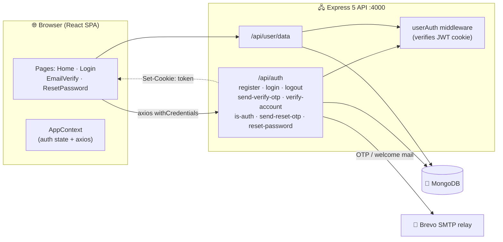
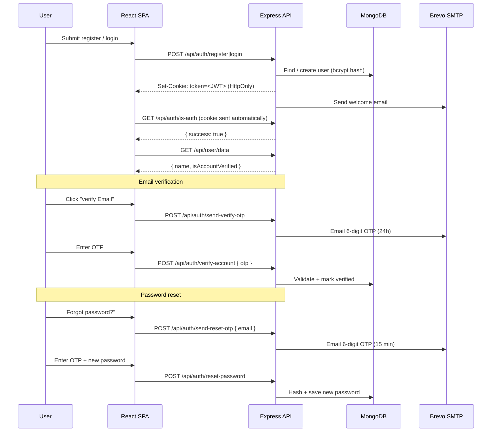

# 🔐 Mrakchi.dev | MERN Auth

> A production-minded MERN authentication starter — email/password auth with **OTP email verification**, **OTP password reset**, and **JWT sessions stored in HttpOnly cookies**.

<p align="center">
  
  
  
  
  
  
  
  
  
</p>

---

## 📖 Table of Contents

- [Overview](#-overview)
- [Why I Built This](#-why-i-built-this)
- [Features](#-features)
- [Tech Stack](#-tech-stack)
- [Architecture](#-architecture)
- [Project Structure](#-project-structure)
- [Getting Started](#-getting-started)
  - [Prerequisites](#prerequisites)
  - [Environment Variables](#environment-variables)
  - [Install & Run](#install--run)
- [API Reference](#-api-reference)
- [Authentication Flow](#-authentication-flow)
- [Database Schema](#-database-schema)
- [Email System](#-email-system)
- [Security Notes](#-security-notes)
- [Known Limitations & Roadmap](#-known-limitations--roadmap)
- [Scripts](#-scripts)
- [Deployment](#-deployment)
- [Contributing](#-contributing)
- [Maintenance & Updates](#-maintenance--updates)
- [License](#-license)
- [Author](#-author)

---

## 🧭 Overview

**MERN Auth** is a complete, self-contained authentication service built on the MERN stack. It demonstrates a secure, cookie-based session model where the JSON Web Token **never touches `localStorage`** — it lives in an `HttpOnly` cookie that the browser sends automatically with every request.

It covers the two flows that most real apps need but tutorials skip:

1. **Account verification** — a 6-digit OTP emailed to the user (valid 24h).
2. **Password recovery** — a 6-digit OTP emailed to the user (valid 15 min).

Everything ships in a clean, readable structure: an Express 5 REST API on the backend and a modern React 19 + Vite SPA on the frontend.

---

## 🎯 Why I Built This

> **This is not a throwaway demo — it's my personal authentication starter kit.**

Every new project seems to need the same handful of things: sign-up, sign-in, sign-out, account activation, "forgot password", and email OTP delivery. Rewriting that boilerplate from scratch on every project is wasted time and a recurring source of bugs.

So I built **MERN Auth** once — as a solid, battle-tested foundation — and now I reuse it. When a new project needs authentication, I simply **clone this repo, re-skin the frontend, and configure `.env`**. The backend, the JWT HttpOnly-cookie sessions, the OTP flows, and the email delivery are already done.

### 🔌 Drop-in for any future project

| What I customize | What I reuse as-is |
|---|---|
| Frontend UI, branding & pages (`client/src`) | Express 5 REST API (`server/`) |
| `.env` values (DB, `JWT_SECRET`, SMTP) | JWT auth in **HttpOnly cookies** |
| Copy, languages & design system | Register · Login · Logout |
| Extra routes & features on top | Email verification **OTP** + password reset **OTP** |

**Covered out of the box:** account creation, login, logout, account activation (verify OTP), forgot-password (reset OTP), and OTP email delivery.

In short: **change the frontend + `.env`, and you have auth working in a new product within minutes** — no need to start from zero.

---

## ✨ Features

### Authentication
- 🧾 **User registration** with server-side bcrypt password hashing (cost factor `10`).
- 🔐 **Login** issuing a signed JWT (`{ id }`, `7d` expiry).
- 🍪 **HttpOnly cookie sessions** — `secure` + `sameSite: none` in production, `strict` in development.
- 🚪 **Logout** that clears the `token` cookie.
- ♻️ **Persistent sessions** — the app re-checks auth state on every load via `/api/auth/is-auth`.

### Email OTP flows
- 📧 **Email verification OTP** (6 digits, 24-hour expiry).
- 🗝️ **Password reset OTP** (6 digits, 15-minute expiry).
- ✉️ **Transactional email** delivery through Nodemailer over the Brevo SMTP relay.
- 🎛️ Ready-made HTML email templates (verify + reset) included in `server/config/emailTemplates.js`.

### Frontend experience
- ⚛️ **React 19** single-page app with **React Router 7**.
- 🎨 **TailwindCSS 3** styling with a dark, gradient auth UI.
- 🔔 **React Toastify** for success/error notifications.
- ⌨️ **6-digit OTP inputs** with auto-advance, backspace navigation, and paste support.
- 🧠 Global auth state via **React Context** (`AppContext`).

### Backend engineering
- 🚏 Clean **routes → controllers → models** separation.
- 🛡️ Reusable `userAuth` JWT middleware for protected endpoints.
- 🌐 **CORS** locked to the frontend origin with `credentials: true`.
- 🖥️ Friendly HTML landing page served on `/` so you instantly know the API is alive.

---

## 🧱 Tech Stack

| Layer | Technology |
|---|---|
| **Frontend** | React 19, Vite 8, React Router 7, Axios, React Toastify, TailwindCSS 3 |
| **Backend** | Node.js, Express 5, jsonwebtoken, bcryptjs, cookie-parser, cors, nodemailer, dotenv |
| **Database** | MongoDB with Mongoose 8 |
| **Auth** | JWT stored in an **HttpOnly** cookie named `token` |
| **Email** | Nodemailer via the Brevo SMTP relay |
| **Tooling** | ESLint (client), nodemon (server), PostCSS, Autoprefixer |

---

## 🏗️ Architecture



**Request lifecycle**

```
Client ──▶ Express ──▶ (userAuth?) ──▶ Controller ──▶ Mongoose ──▶ MongoDB
                                  │
                                  └──▶ Nodemailer ──▶ Brevo ──▶ User inbox
```

---

## 📁 Project Structure

```txt
mern-auth/
├── client/                             # React + Vite frontend
│   ├── public/                         # Static assets (favicon, bg image)
│   ├── src/
│   │   ├── assets/
│   │   │   └── assets.js               # Central asset registry (icons, logo, images)
│   │   ├── components/
│   │   │   ├── Navbar.jsx              # Logo, avatar dropdown (verify / logout)
│   │   │   └── Header.jsx              # Hero section (greets the logged-in user)
│   │   ├── context/
│   │   │   └── AppContext.jsx          # Global auth state + axios config
│   │   ├── pages/
│   │   │   ├── Home.jsx                # Landing page
│   │   │   ├── Login.jsx               # Sign Up / Login (single form, toggled)
│   │   │   ├── EmailVerify.jsx         # 6-digit verification OTP
│   │   │   └── ResetPassword.jsx       # 3-step password reset wizard
│   │   ├── App.jsx                     # Router + ToastContainer
│   │   ├── main.jsx                    # App bootstrap (Router + Context)
│   │   └── index.css                   # Tailwind entry point
│   ├── index.html                      # "Mrakchi.dev | MERN Auth"
│   ├── tailwind.config.js
│   ├── postcss.config.js
│   ├── vite.config.js
│   └── package.json
│
└── server/                             # Express 5 backend
    ├── config/
    │   ├── mongodb.js                  # Mongoose connection
    │   ├── nodemailer.js               # Brevo SMTP transporter
    │   └── emailTemplates.js           # HTML templates (verify + reset)
    ├── controllers/
    │   ├── authController.js           # register/login/logout + OTP flows
    │   └── userController.js           # getUserData
    ├── middleware/
    │   └── userAuth.js                 # JWT cookie verification
    ├── models/
    │   └── userModel.js                # User schema (OTP fields included)
    ├── routes/
    │   ├── authRoutes.js               # /api/auth/* 
    │   └── userRoutes.js               # /api/user/*
    ├── server.js                       # Entry point (app + landing page)
    └── package.json
```

---

## 🚀 Getting Started

### Prerequisites

- **Node.js** 18+ (built and tested with Node 24)
- **MongoDB** — a local instance *or* a MongoDB Atlas cluster
- **SMTP credentials** — a Brevo account (or any SMTP provider, with a small config tweak)

### Environment Variables

Create the following files. Each folder ships a `.env.example` you can copy.

**`server/.env`**

| Variable | Description | Example |
|---|---|---|
| `PORT` | API port | `4000` |
| `NODE_ENV` | Drives cookie `secure` / `sameSite` behavior | `development` |
| `MONGO_URI` | MongoDB connection string | `mongodb://127.0.0.1:27017/mern-auth` |
| `JWT_SECRET` | Secret used to sign/verify JWTs | `a-long-random-string` |
| `SENDER_EMAIL` | "From" address used by Nodemailer | `you@example.com` |
| `SMTP_USER` | Brevo SMTP username | `…@smtp-brevo.com` |
| `SMTP_PASS` | Brevo SMTP password / key | `********` |

**`client/.env`**

| Variable | Description | Example |
|---|---|---|
| `VITE_BACKEND_URL` | Base URL of the API | `http://localhost:4000` |

### Install & Run

Run the backend and frontend in **two terminals**.

**1) Backend**

```bash
cd server
npm install
npm run start      # nodemon server.js  → http://localhost:4000
```

**2) Frontend**

```bash
cd client
npm install
npm run dev        # vite              → http://localhost:5173
```

> The frontend calls the API through `VITE_BACKEND_URL`, and the API only accepts requests from `http://localhost:5173` (see `allowedOrigins` in `server/server.js`). Keep these in sync.

---

## 📡 API Reference

- **Base URLs:** `/api/auth/*` and `/api/user/*`
- **Auth method:** JWT stored in an **HttpOnly cookie named `token`**
- **Body format:** JSON. The client uses `axios` with `withCredentials: true`.
- **Response shape:** `{ success: boolean, message?: string, userData?: object }`

### Auth Routes — `/api/auth`

| # | Method | Endpoint | Auth | Body | Success message |
|---|---|---|---|---|---|
| 1 | `POST` | `/register` | Public | `name, email, password` | `{ success: true }` |
| 2 | `POST` | `/login` | Public | `email, password` | `{ success: true }` |
| 3 | `POST` | `/logout` | Public | — | `Logged out successfully` |
| 4 | `POST` | `/send-verify-otp` | 🔒 Required | — | `OTP sent to email` |
| 5 | `POST` | `/verify-account` | 🔒 Required | `otp` | `Email verified successfully` |
| 6 | `GET` | `/is-auth` | 🔒 Required | — | `{ success: true }` |
| 7 | `POST` | `/send-reset-otp` | Public | `email` | `OTP sent to email` |
| 8 | `POST` | `/reset-password` | Public | `email, otp, newPassword` | `Password has been reset successfully` |

### User Routes — `/api/user`

| Method | Endpoint | Auth | Description |
|---|---|---|---|
| `GET` | `/data` | 🔒 Required | Returns `{ name, isAccountVerified }` for the current user |

### Selected Endpoint Details

<details>
<summary><b>POST <code>/api/auth/register</code></b></summary>

Creates a user, hashes the password with bcrypt, sets the `token` cookie, and sends a welcome email.

```json
// Request
{ "name": "Hamza", "email": "hamza@example.com", "password": "super-secret" }

// Response
{ "success": true }
```
</details>

<details>
<summary><b>POST <code>/api/auth/verify-account</code></b> &nbsp;🔒</summary>

Verifies the OTP sent to the authenticated user's email.

```json
// Request (userId comes from the JWT cookie)
{ "otp": "482913" }

// Response
{ "success": true, "message": "Email verified successfully" }
```
</details>

<details>
<summary><b>POST <code>/api/auth/reset-password</code></b></summary>

Validates the reset OTP, hashes the new password, and clears the OTP fields.

```json
// Request
{ "email": "hamza@example.com", "otp": "109284", "newPassword": "new-secret" }

// Response
{ "success": true, "message": "Password has been reset successfully" }
```
</details>

<details>
<summary><b>Protected request failure</b></summary>

When the `token` cookie is missing or invalid, `userAuth` short-circuits the request:

```json
{ "success": false, "message": "User not authenticated - Login again" }
```
</details>

---

## 🔑 Authentication Flow



**How the cookie is set** (from `authController.js`):

```js
res.cookie("token", token, {
  httpOnly: true,
  secure: process.env.NODE_ENV === "production",
  sameSite: process.env.NODE_ENV === "production" ? "none" : "strict",
  maxAge: 7 * 24 * 60 * 60 * 1000, // 7 days
});
```

- JWT payload: `{ id: user._id }`
- Signed with `JWT_SECRET`, expires in `7d`
- Verified by `userAuth`, which populates `req.user = { userId }`

---

## 🗄️ Database Schema

**`User`** model (`server/models/userModel.js`):

| Field | Type | Default | Notes |
|---|---|---|---|
| `name` | `String` | — | required |
| `email` | `String` | — | required, **unique** |
| `password` | `String` | — | required, bcrypt hash |
| `verifyOtp` | `String` | `''` | current verification OTP |
| `verifyOtpExpireAT` | `Number` | `0` | timestamp, +24h on issue |
| `isAccountVerified` | `Boolean` | `false` | flips to `true` after verification |
| `resetOtp` | `String` | `''` | current password-reset OTP |
| `resetOtpExpireAt` | `Number` | `0` | timestamp, +15min on issue |

---

## 📨 Email System

- **Transport:** `server/config/nodemailer.js` — `smtp-relay.brevo.com:587`.
- **Templates:** two polished HTML templates live in `server/config/emailTemplates.js`:
  - `EMAIL_VERIFY_TEMPLATE` (placeholders `{{email}}`, `{{otp}}`)
  - `PASSWORD_RESET_TEMPLATE` (placeholders `{{email}}`, `{{otp}}`)
- **Current behavior:** `authController.js` sends **plain-text** OTP emails. The HTML templates are ready but **not yet wired in** — see the roadmap below.

---

## 🛡️ Security Notes

- ✅ **HttpOnly cookie** — the JWT is inaccessible to JavaScript, mitigating XSS token theft.
- ✅ **bcrypt hashing** — passwords are never stored in plain text.
- ✅ **OTP expirations** enforced server-side (24h verify / 15 min reset).
- ✅ **CORS restricted** to `http://localhost:5173` with credentials enabled.
- ✅ **Environment secrets** — `.env` files are git-ignored via `.gitignore`.

> ⚠️ This is a starter/reference implementation. Before production, review the [Known Limitations & Roadmap](#-known-limitations--roadmap) below.

---

## 🧪 Known Limitations & Roadmap

These are intentional, documented gaps — great first contributions:

- [ ] **Rate limiting** on `send-verify-otp` and `send-reset-otp` to prevent OTP spam/brute force.
- [ ] **Hash OTPs at rest** instead of storing them as plain text.
- [ ] **Wire up the HTML email templates** (currently only used as static templates).
- [ ] **Consistent HTTP status codes** (responses currently return `200` with a `success` flag).
- [ ] **Input validation & sanitization** layer (e.g. `express-validator` / `zod`).
- [ ] **Automated tests** (unit + integration) and a CI workflow.
- [ ] **Refresh-token rotation** for long-lived sessions.
- [ ] **Password strength policy** and per-field server-side checks.
- [ ] Make `NODE_ENV`, CORS origins, and the frontend URL fully configurable.

---

## 🧰 Scripts

### Server (`server/package.json`)

| Script | Command |
|---|---|
| `npm run start` | `nodemon server.js` |

### Client (`client/package.json`)

| Script | Command |
|---|---|
| `npm run dev` | `vite` |
| `npm run build` | `vite build` |
| `npm run preview` | `vite preview` |
| `npm run lint` | `eslint .` |

---

## ☁️ Deployment

1. **Database** — provision MongoDB Atlas (or self-host) and grab the connection string.
2. **Backend** — deploy to Render / Railway / Fly.io / a VPS and set:
   `MONGO_URI`, `JWT_SECRET`, `NODE_ENV=production`, `SENDER_EMAIL`, `SMTP_USER`, `SMTP_PASS`.
3. **Frontend** — deploy to Netlify / Vercel / any static host and set:
   `VITE_BACKEND_URL` to your public API URL.
4. **HTTPS** — required in production so the `secure` cookie is accepted.
5. **CORS** — add your production frontend origin to `allowedOrigins` in `server/server.js`.

---

## 🤝 Contributing

Contributions, issues, and feature requests are welcome.

1. Fork the repo
2. Create your branch: `git checkout -b feature/amazing-feature`
3. Commit your changes: `git commit -m "Add amazing feature"`
4. Push: `git push origin feature/amazing-feature`
5. Open a Pull Request

---

## 🔄 Maintenance & Updates

This project is a **living starter template**, not a frozen snapshot.

- 📦 It receives **periodic updates** — new auth features, hardening, and improvements land over time.
- 🔐 Dependencies and security best practices are kept current.
- ♻️ Every project built on top of it benefits from those updates automatically.
- ⭐ **Tip:** star/watch the repo or pull the latest `main` before starting your next project, so you always begin from the freshest base.

---

## 📄 License

Released under the **MIT** License — free to use, modify, and distribute, including in commercial projects. See [`LICENSE`](./LICENSE) for details.

---
---

## 👨‍💻 Author

<p align="center">
  
</p>


<p align="center">
  <b>Hamza Mrakchi</b> — Full-Stack Developer & System Architect
</p>


<p align="center">
  <a href="https://github.com/wickmrakchi">
    
  </a>
  <a href="https://www.instagram.com/mrakchi_5/">
    
  </a>
  <a href="mailto:hessamgrati@gmail.com">
    
  </a>
  <a href="https://www.paypal.com/paypalme/Essamgrati">
    
  </a>
  <a href="https://discord.gg/VyX7RTWxm4">
    
  </a>
</p>


---


<p align="center">
  
</p>
